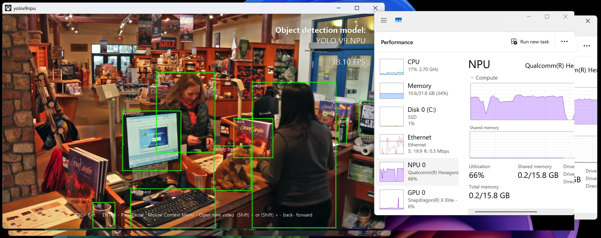

# YOLOv9 NPU sample

Implements the YOLO94 real-time object detection model using DirectML, DirectMLX and Onnx runtime with the Qualcomm Hexagon NPU (and other NPU's?)

YOLOv9 is an object detection model capable of recognizing up to 80 different classes of objects in an image. This sample contains a complete end-to-end implementation of the model using DirectML, and is able to run in real time on a user-provided video stream. 

## Downloading ONNX model

This sample requires an external download of the ONNX YOLOv9 model, which are roughly 250MB large. The .vcxproj file is configured to download the file automatically, but it can also be downloaded manually here:
* https://drive.usercontent.google.com/download?id=1Yzu-vlH0mw2Jz8yBkkh12xuoDEDesDhN
* The model **Model_Yolo_v9c_f16.onnx** is created by:
* https://github.com/DakeQQ/YOLO-Depth-Estimation-for-Android

The file should be placed in a "Data" subdirectory. e.g.

`<repo root>/Data/Model_Yolo_v9c_f16.onnx`

## Power unsage and Performance

This sample demonstrates real time perfromance on a Snapdragon X Elite Dev Box. Compared to the orihginal YOLOv4 DirectML Sample running on the GPU, this implementation runs more than twice as fast using less than half the power (15W compated to 40W on the GPU)

## External links

* Paper: [YOLOv4: Optimal Speed and Accuracy of Object Detection
 (arXiv)](https://arxiv.org/abs/2004.10934)
* Original GitHub: https://github.com/AlexeyAB/darknet
* TensorFlow implementation: https://github.com/hunglc007/tensorflow-yolov4-tflite
